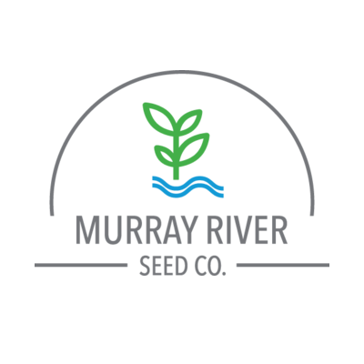

 
 
 
 
 

## Welcome to the GitHub home of Murray River Seed Co

Murray River Seed Co. is a new generation vegetable seed company located on the fertile soils of the Murray River in Albury, Australia.
We are here to create a network of independent breeders that along with our own targeted breeding program, will provide innovative solutions for vegetable seeds customers around the world. 
The company is founded by vegetable seed industry professionals who strive to do things differently. 
